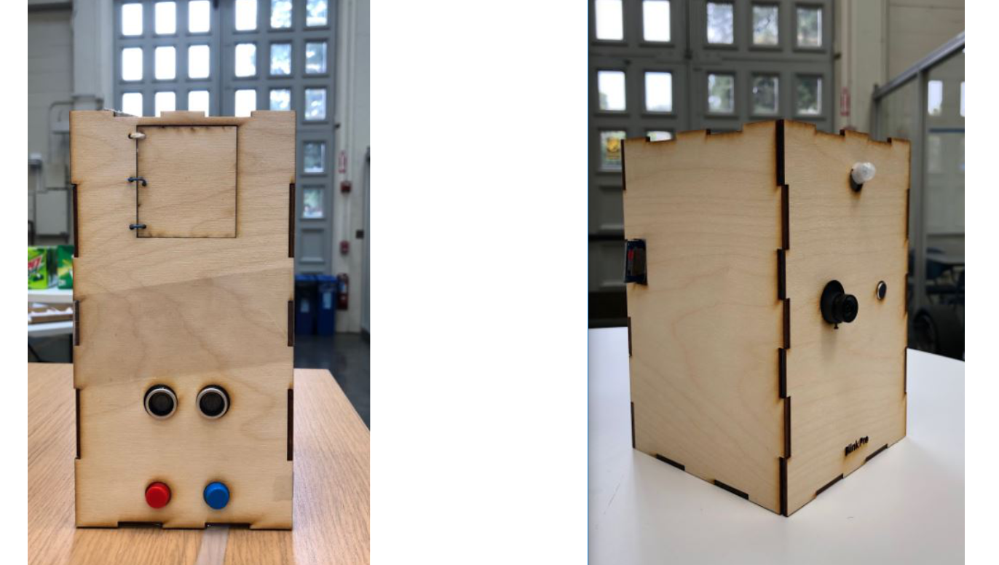
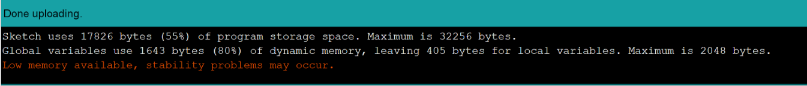

# Blink- Smart Doorbell
Security, connection, convenience.  A doorbell add-on that upon sensing movement, captures a picture and takes an audio recording till the motion ceases. Additionally, it permits communication between the visitor and the home-owner by allowing visitors to send texts in case they arrive in the absence of the home-owner. The home-owner also has a secure button-operated command on their phone to open a compartment in the doorbell body that they can use to store things in. 


<h2>Problem</h2>
Living in Berkeley, it isn't a surprise that my neighbourhood is plagued with robberies and break-ins. Being a college student, I couldn't afford to buy a security system, so I decided to make my own using items I had lying around. I demo-ed this project for my EE49 class. 



<h2> Honest disclaimer: </h2>
This project is by no means ideal - if I could redo things, I would use a raspberry pi and use that to condense every thing into one model. Furthermore, I could also add a facial recognition feature in that for my housemates and I, so that the SD card doesn't waste unnecessary space on taking our picture. This project made the use of both an ESP32 and an Arduino Uno - However, the entire project could be made with just an Arduino Uno. The reason I chose not to do so is because my Uno board is unstable handling too many tasks. Since I did not want to invest in another, and had an ESP32 lying around, I decide to split this project up into two different components - one that handles security (Arduino) and the other that handles communication. 




<h2> Solution:</h2>

     
     
    
<h2>Circuit Diagram</h2>
The diagram for the ESP32 connections are given below:


<h2>ESP32 INSTRUCTIONS: </h2>
<ol>
     <li>Setup</li>
     <li>Flashing Files</li>
     <li>The Code</li>
     <li>Optional</li>
</ol>

<h3>1) Setup</h3>
I strongly recommend using <a href = "https://github.com/bboser/IoT49/blob/master/doc/install.md">Professor Bernard Boser's</a> set of instructions on how to set up your ESP-32. If you have already set up your ESP32, just ensure that it is compatible with MicroPython firmware.


<h3>2) Flashing Files</h3>
Flash these files so that your ESP32 can automatically connect to the internet and communicate using MQTT to adafruit. 

For WIFI.py:
Change the '<add here>' part of the code with your network name and password, and then go to repl and copy the file using cp. It's important that you copy it as boot.py as you want your ESP32 to autoconnect to the wifi.

```
wlan.connect('<add here>', '<add here>', 5000)
```
```
cp <location where the file is on your pc> /flash/boot.py
```

For umqtt.py: 
```
cp  <location where the file is in your pc> /flash/umqtt.py
```
Note: If you chose to save as anything other than umqtt.py then make sure to change that in the final code, where you are importing it.


<h3>3) The Code</h3>
Clone the micropython files in this repository and change the part of the code that is meant to be customized. I've made all additions of the format "add here".


<h3>4) Optional</h3>
In case you have (and want to use an HCSR04) sensor, you can add the hcsr04.py to your project. Be sure to import it in the final.py code.
```
cp <location where the file is on your pc> /flash/hcsr04.py
```

```
import hcsr04
from hcsr04 import HCSR04
```

A little sample on how to use it :
```
sensor = HCSR04(trigger_pin=A5, echo_pin=A20)
distance = sensor.distance_cm()
```


<h2> Credits: </h2>
Andrew Ansell, who helped laser cut and 3D print the items (and saved me the trouble of getting a makers pass!)
