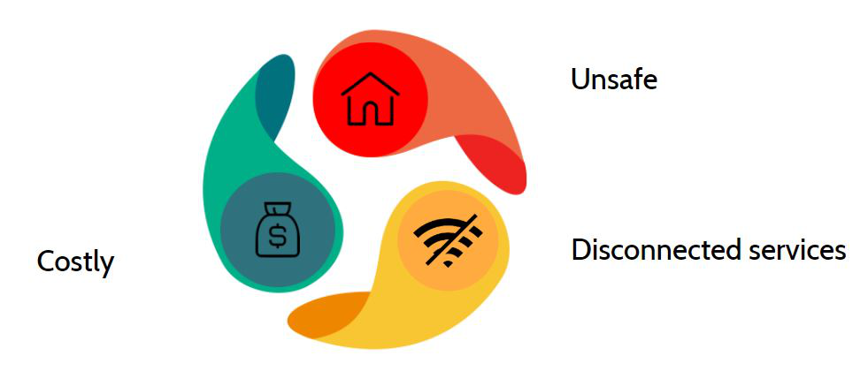
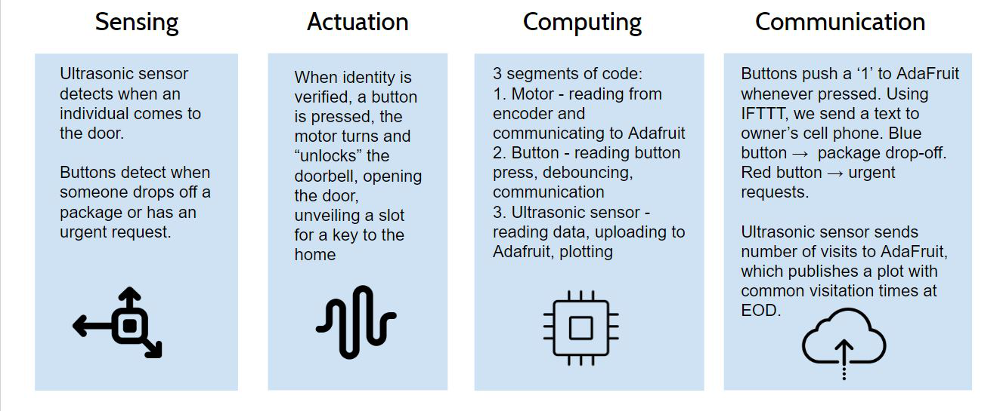
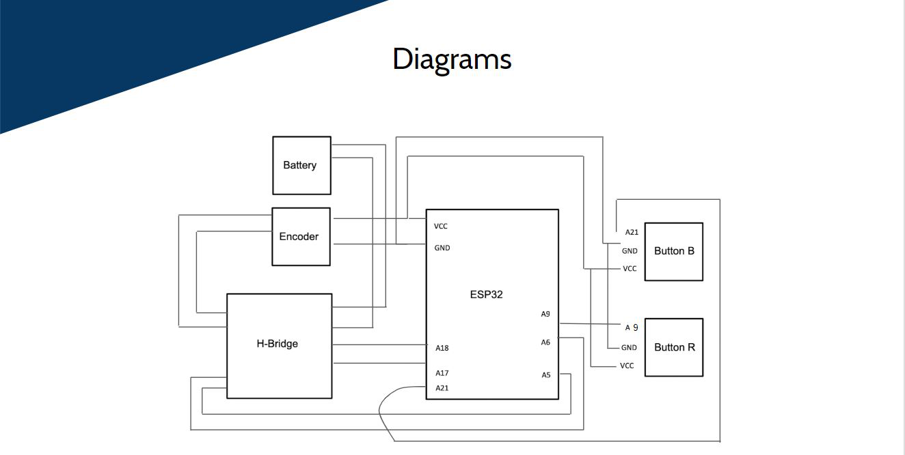
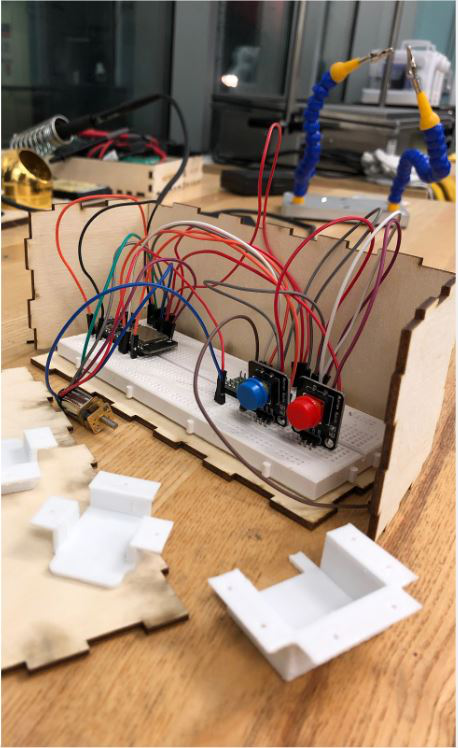

# Blink- Smart Doorbell
Security, connection, convenience.  A doorbell add-on that upon sensing movement, captures a picture and takes an audio recording till the motion ceases. Additionally, it permits communication between the visitor and the home-owner by allowing visitors to send texts in case they arrive in the absence of the home-owner. The home-owner also has a secure button-operated command on their phone to open a compartment in the doorbell body that they can use to store things in. 

<h2>Problem</h2>
Living in Berkeley, it isn't a surprise that my neighbourhood is plagued with robberies and break-ins. Being a college student, I couldn't afford to buy a security system, so I decided to make my own using items I had lying around. I demo-ed this project for my EE49 class. 

<h2> Solution:</h2>

     
<h2>Circuit Diagram</h2>
The diagram for the ESP32 connections are given below:

<h2> Honest disclaimer: </h2>
This project is by no means ideal - if I could redo things, I would use a raspberry pi and use that to condense every thing into one model. Furthermore, I could also add a facial recognition feature in that for my housemates and I, so that the SD card doesn't waste unnecessary space on taking our picture. This project made the use of both an ESP32 and an Arduino Uno - However, the entire project could be made with just an Arduino Uno. The reason I chose not to do so is because my Uno board is unstable handling too many tasks. Since I did not want to invest in another and had an ESP32 lying around, I decide to split this project up into two different components - one that handles security (Arduino) and the other that handles communication. 

<h2> Credits: </h2>
Andrew Ansell, who helped laser cut and 3D print the items (and saved me the trouble of getting a makers pass!)
